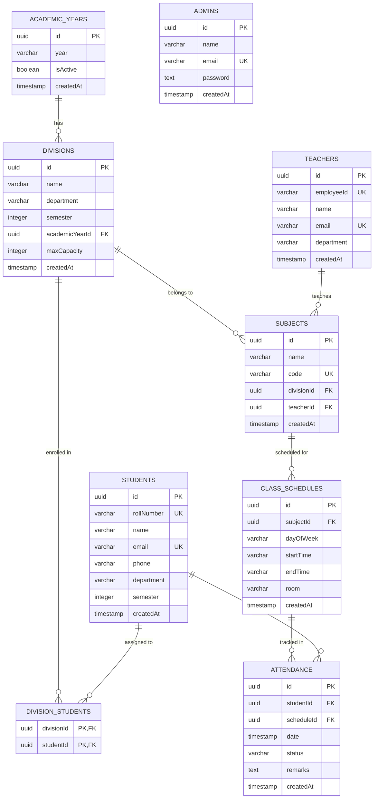

# 🛡️ GIT-Connect-Admin (Attendance Management System)

A state-of-the-art administrative portal and mobile client built using **Expo (React Native)**, **TypeScript**, **Drizzle ORM**, and **Neon Serverless PostgreSQL**. This application serves as the control center for managing student enrollment, teacher assignment, timetable schedules, divisions, and comprehensive academic attendance tracking.

---

## 🚀 Key Highlights & Tech Stack

- **Framework**: [Expo SDK 54](https://expo.dev) & React Native (0.81) with React 19.
- **Routing**: [Expo Router](https://docs.expo.dev/router/introduction) featuring file-based routing and hybrid **API Routes** (`+api.ts` serverless endpoints).
- **Database**: [Neon Database](https://neon.tech) (Serverless PostgreSQL) for cloud-native, highly available data storage.
- **ORM**: [Drizzle ORM](https://orm.drizzle.team) for type-safe query building, schema definition, and easy migrations.
- **Styling & Components**: Highly polished themed components with seamless Light/Dark mode support.
- **Architecture**: Universal codebase running on **Android**, **iOS**, and the **Web** using the same TypeScript files.

---

## 📁 Repository Structure

```filepath
├── app/                      # Expo Router navigation and entry points
│   ├── (tabs)/               # Main admin navigation tabs (Dashboard, Divisions, Students, etc.)
│   │   ├── dashboard.tsx     # Admin overview and quick-action hub
│   │   ├── divisions.tsx     # CRUD interfaces for divisions/classes
│   │   ├── students.tsx      # Student roster management and division mapping
│   │   ├── teachers.tsx      # Teacher list, contact records, and subject assignment
│   │   ├── subjects.tsx      # Academic courses and timetable schedules
│   │   ├── reports.tsx       # Live attendance statistics & logs
│   │   └── _layout.tsx       # Bottom tab navigation shell
│   ├── api/                  # Expo Router backend API routes (serverless +api.ts endpoints)
│   │   ├── attendance+api.ts # Attendance check-ins and history endpoints
│   │   ├── login+api.ts      # Administrator credentials matching
│   │   ├── stats+api.ts      # Telemetry aggregation for dashboard widgets
│   │   └── ...               # Additional CRUD API endpoints (students, teachers, divisions, etc.)
│   ├── login.tsx             # Secure login screen with validation
│   ├── index.tsx             # Routing gatekeeper checking auth state
│   └── _layout.tsx           # Global root application wrapper
├── db/                       # Database entry and schema configurations
│   ├── index.ts              # Neon client instance and Drizzle initialization
│   └── schema.ts             # Complete PostgreSQL schema definitions
├── drizzle/                  # Drizzle ORM generated migration SQL files
├── components/               # Reusable UI widgets and custom modal dialogues
├── constants/                # Universal theme colors, fonts, and base configurations
├── utils/                    # Shared utilities (logger, local state persistent storage)
├── package.json              # Project dependencies and script runner commands
├── drizzle.config.ts         # Drizzle Kit CLI database adapter settings
└── eas.json                  # EAS CLI configurations for building native mobile binaries
```

---

## 💾 Database Schema

The database model is designed with highly normalized tables. Relationships are enforced via PostgreSQL foreign keys, managed dynamically using Drizzle ORM:



---

## 🛠️ Getting Started

### 1. Prerequisites
- **Node.js**: `v18.x` or higher
- **Package Manager**: `npm`
- **Expo Go** app (installed on your physical iOS/Android device) or an emulator configured in Android Studio / Xcode.
- **Neon Postgres Database**: Ensure you have an active database instance on Neon.

### 2. Environment Variables Setup
Create a `.env` file in the root directory of the project and populate it with your credentials:
```env
DATABASE_URL=postgresql://<user>:<password>@<neon-hostname>/<dbname>?sslmode=require
```

### 3. Install Dependencies
Install all package dependencies via `npm`:
```bash
npm install
```

### 4. Database Setup & Migrations
Synchronize your Neon Postgres instance with the schemas defined in `db/schema.ts` using Drizzle Kit:

```bash
# Generate SQL migrations
npx drizzle-kit generate

# Run migrations against Neon DB
npx drizzle-kit push
```

Alternatively, you can run the standalone migration scripts:
```bash
# Run migration using Node.js
node apply_migration.mjs
```

### 5. Running the Application

Start the Expo bundler:
```bash
npx expo start
```

Inside the interactive terminal prompt:
- Press **`a`** to launch the app on an Android emulator or connected device.
- Press **`i`** to launch on an iOS simulator.
- Press **`w`** to open the app directly inside a desktop browser.
- Scan the QR code with your phone's camera (iOS) or the Expo Go App (Android) to test on a physical device.

---

## 📦 Building and Deployment

### 📱 Generating Native Apps (EAS Build)
We use Expo Application Services (EAS) to compile and build production-ready packages:

```bash
# Log in to Expo account
npx eas login

# Configure EAS project
npx eas build:configure

# Build local APK for Android testing
npx eas build --platform android --profile development --local
```

### 🌐 Deploying API & Web Client
Since the web build configuration `output: "server"` is active in `app.json`, the app compiles as a server-rendered project suitable for deploying to platforms supporting Node.js adapters (e.g. Vercel, Railway, or AWS).

---

## 🤝 Contributing
1. Create a descriptive feature branch (`git checkout -b feature/awesome-feature`).
2. Commit your code modifications.
3. Push to your branch (`git push origin feature/awesome-feature`).
4. Open a Pull Request detailing the updates.
